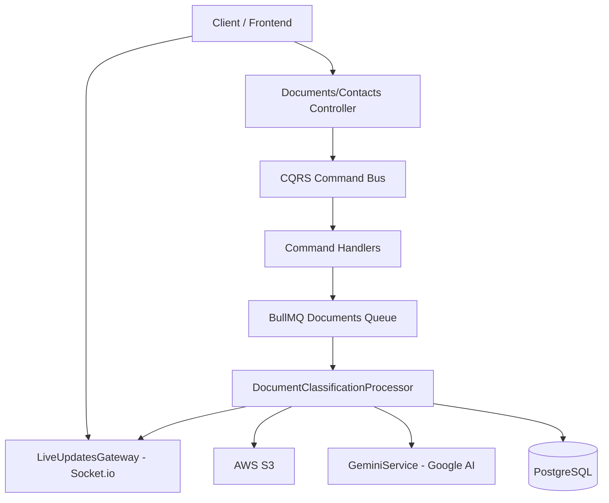

# Project Technical Documentation: Ingestion Backend Hackathon

## 1. Project Overview
The `ingestion-backend-hackathon` is a NestJS-based backend service designed for an education CRM. Its primary purpose is to automate the ingestion, classification, and data extraction from various student-related documents (resumes, transcripts, test scores, etc.) using AI-powered services.

## 2. System Architecture
The system follows a modular architecture using NestJS, leveraging CQRS (Command Query Responsibility Segregation) for handling complex business logic and BullMQ for asynchronous background processing.

## 3. Technology Stack
- **Framework:** NestJS (v11+)
- **Language:** TypeScript
- **Database:** PostgreSQL with TypeORM
- **Asynchronous Processing:** BullMQ (Redis-backed)
- **AI Integration:** Google Gemini API (Pro & Flash models)
- **Object Storage:** AWS S3 (via `@aws-sdk/client-s3`)
- **Real-time Communication:** Socket.io
- **Infrastructure:** Docker & Docker Compose

## 4. Core Workflows

### 4.1 Document Ingestion Pipeline
1.  **Upload:** Files are uploaded via `UploadController` and stored in AWS S3.
2.  **Queueing:** A job is added to the `documents` queue containing the S3 path and metadata.
3.  **Classification:** The `DocumentClassificationProcessor` triggers `GeminiService.classifyDocument` to identify the document type (e.g., resume, transcript).
4.  **Extraction:** If the document is identified as a relevant type, `GeminiService.extractDocumentData` is called with a structured schema (`MASTER_EXTRACTION_SCHEMA`) to extract data like contact info, education, and test scores.
5.  **Persistence:** Extracted data and classification results are saved to the PostgreSQL database.
6.  **Real-time Updates:** Status updates (processing, extracting, parsed, failed) are emitted via `LiveUpdatesGateway` to the frontend.

### 4.2 Contact Management
- **CRUD Operations:** Standard operations for managing student contacts.
- **Data Association:** Documents are linked to specific contacts, and extracted data can be used to update or populate contact profiles.

## 5. Directory Structure
- `src/contacts/`: Contact management modules, entities, and handlers.
- `src/documents/`: Document processing logic, Gemini service integration, and schemas.
- `src/queues/`: BullMQ processor definitions for background tasks.
- `src/notifications/`: Socket.io gateway for real-time status updates.
- `src/database/`: TypeORM configuration and migrations.
- `src/config/`: Centralized configuration for S3, Gemini, Redis, and Database.

## 6. Configuration & Environment Variables
The following environment variables are required (see `.env.example`):
- `PORT`: Server port
- `DATABASE_URL`: PostgreSQL connection string
- `REDIS_HOST`, `REDIS_PORT`: Redis connection for BullMQ
- `AWS_ACCESS_KEY_ID`, `AWS_SECRET_ACCESS_KEY`, `AWS_S3_REGION`, `AWS_S3_BUCKET`: S3 configuration
- `GEMINI_API_KEY`: API key for Google Generative AI

## 7. Setup & Development

### Local Setup
1.  **Install Dependencies:** `npm install`
2.  **Environment Setup:** Copy `.env.example` to `.env` and fill in the values.
3.  **Run Services:** Use Docker Compose for local database and redis: `docker-compose up -d`
4.  **Run Migrations:** `npm run migration:run`
5.  **Start Application:** `npm run start:dev`

### Testing
- **Unit Tests:** `npm run test`
- **E2E Tests:** `npm run test:e2e`
